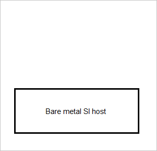
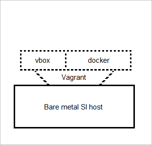
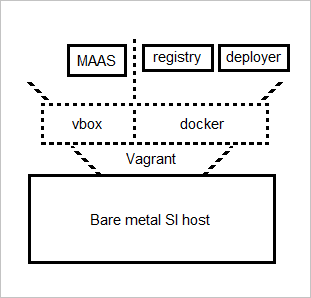
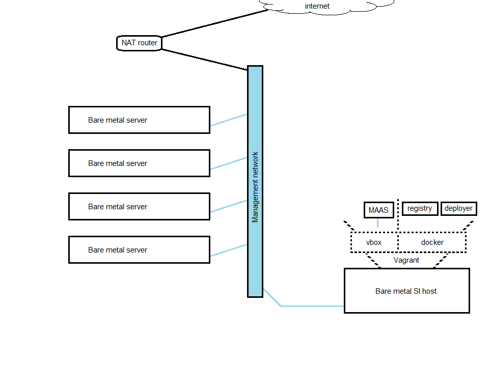
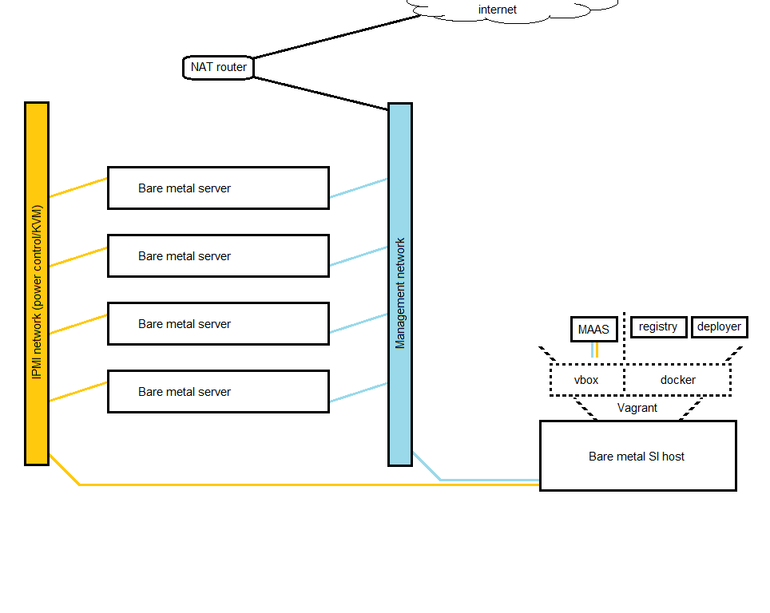
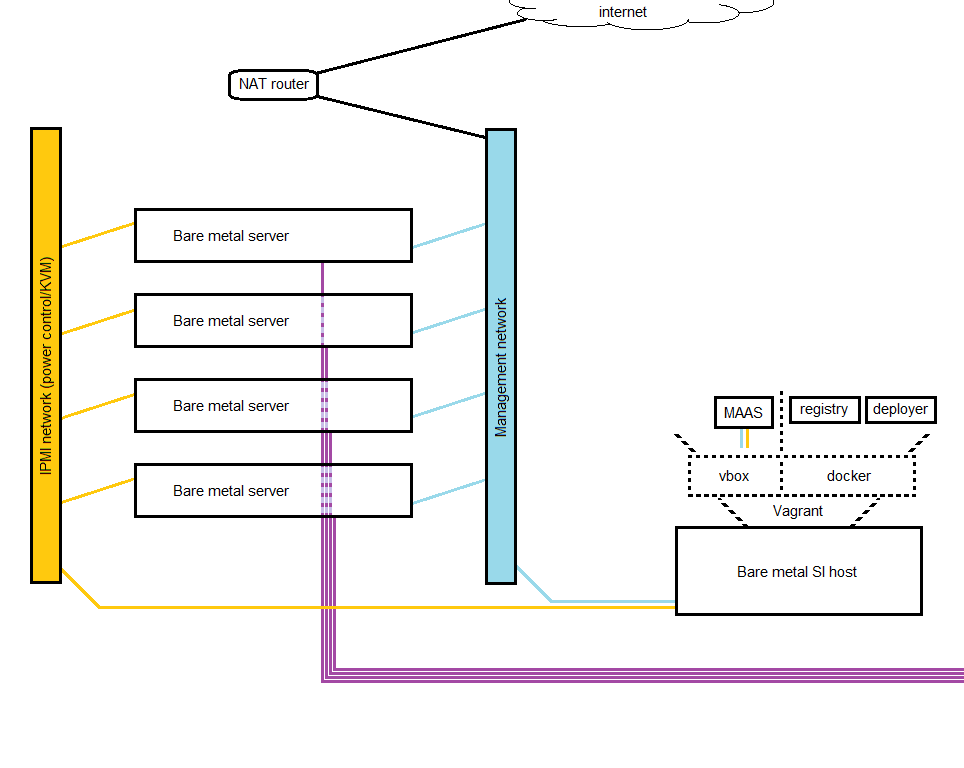

# Kolla deployment to PXE-booted bare metal hosts

### Layout of supporting infrastructure
Supporting infrastructure (Kolla deployer host, Canonical's MAAS, private Docker registry, etc.) are run inside Vagrant. While this layout is not targeted specifically to test/dev environments, running these components within Vagrant streamlines setup and maximizes repeatability.



A single bare metal host is deployed with Vagrant, Docker, and Virtualbox (or similar virtualization product for which there is a Vagrant provider [VMware Workstation, libvirt, etc.]). This host will be referred to simply as the SI (Supporting Infrastructure) host. This is not a Kolla or OpenStack term, and is only used in this repo. No OpenStack services run on the SI host and it does not have to stay online once the deployment is complete, but preserving its data is highly recommended to facilitate using Kolla to run upgrades later. Some things like MAAS's list of enrolled hosts are persistent and we pass this list as a dynamic inventory for Ansible to use with Kolla.



The SI host runs several Vagrant machines, each containing a piece of supporting infrastructure. These Vagrant machines are arranged as follows:
 - Running under Vagrant's virtualbox provider, a virtual machine (kpm-maaspxe) running MAAS to handle PXE-boot services and IPMI power management
 - Running under Vagrant's docker provider, a container (kpm-preg) running Docker's registry:2 private registry image for Kolla to use
 - Also running under Vagrant's docker provider, a container (kpm-kolla) that acts as Kolla's deployer/operator host, and is where the command to build (build.py / kolla-build) container images for Kolla is run.



### Layout of the physical network
The vlan terminology used here is described in terms of "vlan is untagged for port" and/or "vlan is tagged for port(s)". This terminology is common on many vendor's hardware such as D-Link and Netgear, but has also been seen on some midrange Cisco Business switches. It is assumed that anyone using the (arguably more traditional) access/trunk terminology will translate this reference layout to their environment.

1. A vlan for management network
  - This network has Internet access behind a NAT router.
  - The IP addresses for the hosts in Ansible's inventory are in this network, and Kolla's management VIP is also chosen as an unused IP in this network (config option: 'kolla_internal_vip_address').
  - The MAAS Vagrant guest handles DHCP on this network. Hardware that needs an IP prior to the MAAS guest coming up (this far: the router, the switch, the physical deployment host, the MAAS VM itself) are statically assigned.



2. A vlan for IPMI network.
  - If your hosts have dedicated IPMI NICs, the ports they plug into are untagged on the switch for this network.
  - If your hosts have shared IPMI NICs, the ports they plug into are untagged for the NIC's primary function and the 
  - Other ports are set as tagged for this network as-needed (such as the uplink to the NAT router).
  - DHCP for the IPMI network is provided by the NAT router (the existing test setup runs the DHCP server on a vlan interface added to the router for this network, so you may need more than a SOHO router to do this - Mikrotik RB450G in use here.)



3. External/provider network access
  - At least one NIC on each host is configured to be used for external/provider network access (config option: 'kolla_external_vip_interface').



### SI Host Install

 - Install an OS on the SI (Supporting Infrastructure) host. Ubuntu 15.10 Wily x64 used for creating this document.
   - You should be prompted to create a local account during install.
   - After install set up your two network interfaces such that:
     - You have one NIC connected to the IPMI network with a DHCP address. The address you recieve on this interface does not matter for the most part, it just allows you to issue IPMI commands to your nodes.
     - You have one NIC connected to the management network with a static IP address, as described above. (10.101.10.15 was used here, with the NAT router located at 10.101.10.1)
     - Your have a single default gateway which is set to the NAT router and uses the interface on the management network.
   - Install an SSH server on the SI host, then SSH to it on the management interface as the local user created during install and then continue with the following installs:  
        ```
        # tools
        sudo apt-get -qy update
        sudo apt-get -qy install curl git ipmitool vim wget
        
        # install appropriate Vagrant
        wget https://releases.hashicorp.com/vagrant/1.8.1/vagrant_1.8.1_x86_64.deb
        sudo dpkg -i vagrant_1.8.1_x86_64.deb
        
        # fix missing deb package deps (if any) not included by 'dpkg -i'
        sudo apt-get install -f
        
        # install appropriate VirtualBox
        wget http://download.virtualbox.org/virtualbox/5.0.14/virtualbox-5.0_5.0.14-105127~Ubuntu~wily_amd64.deb
        sudo dpkg -i virtualbox-5.0_5.0.14-105127~Ubuntu~wily_amd64.deb
        
        # fix missing deb package deps (if any) not included by 'dpkg -i'
        sudo apt-get install -f
        
        # make Kolla build images and deploy faster
        # DO NOT USE THIS (the nobarrier flag) IN PRODUCTION UNLESS YOU HAVE
        # THE EQUIPMENT AND KNOW HOW TO MAKE IT "SAFE" (OR IF YOU WANT TO
        # LOSE DATA ON WHEN THERE IS A POWER OUTAGE)
        sudo mount / -o remount,nobarrier,noatime,nodiratime
        
        # run Docker's installer
        sudo su root -c "curl -sSL https://get.docker.io | bash"
        
        # add your user to the docker group
        sudo usermod -aG docker "$(whoami)"
        ```

 - Log out and log back in for docker group changes to take effect

 - Set/override vars. These are primarily scoped to this repo and used in this Vagrantfile. They are used in configuring MAAS and $DPLYR_MGMTNET_IP, for example, is passed in to the kpm-kolla container and used as the docker registry push target when building container images with Kolla. While you may need to set these again for some things (perhaps you removed the kpm-kolla container and need to recreate it to rebuild container images and run a 'kolla-ansible upgrade'), these are NOT directly referenced in day-to-day cloud operation.  
    ```
    export DPLYR_MGMTNET_IP='10.101.10.15'  # the SI host
    export MAASVM_IPMINET_IP='10.100.10.16'  # the MAAS VM's IP on the IPMI network
    export MAASVM_MGMTNET_IP='10.101.10.16'  # the MAAS VM's IP on the management network
    #export MAASVM_DEFAULTGW_IP='10.101.10.3'  # assumes the '.1' of the management IP if not defined
    #export MAAS_ADMIN_USER='admin'
    #export MAAS_ADMIN_EMAIL='admin@example.com'
    #export MAAS_ADMIN_PASS='admin'
    ```

 - Check out repo and bring up kpm-maaspxe  
    ```
    git clone https://github.com/ropsoft/KPM.git && cd KPM
    vagrant up kpm-maaspxe --provider=virtualbox
    ```

### Finish configuring MAAS

- On the actual, physical SI host (not inside a Vagrant machine), add the keypair you will use to SSH in to the nodes once deployed:  
    ```
    cd  # do this from the local account's $HOME
    mkdir .ssh
    vim .ssh/id_rsa  # paste private key in
    chmod 600 .ssh/id_rsa
    vim .ssh/id_rsa.pub  # paste public key in
    ```

- In the MAAS web interface:
  - Add the public half of the SSH key to the MAAS user that will be used for the deploy.
  - Enable DHCP and DNS from MAAS on the mgmt interface. As of MAAS 1.9.x you must set a static and dynamic DHCP range that does not overlap and is not otherwise in use.

### Install OSes with MAAS

 - Configure the BIOS of all target hosts to boot from the hard disk the OS will be installed to, then shut the hosts down.
 - Use ipmitool to set the hosts to boot one time from the network, then start/restart them. This example assumes 3 hosts and IPMI creditials of ADMIN/ADMIN, which you should substitute for your actual credentials (but note that MAAS will make its own IPMI account during the 'Commision' stage of adding the hosts to MAAS):  
    ```
    IPMI_USER='ADMIN'
    IPMI_PASS='ADMIN'
    ipmitool -H 10.100.10.95 -U "${IPMI_USER}" -P "${IPMI_PASS}" chassis bootdev pxe
    ipmitool -H 10.100.10.96 -U "${IPMI_USER}" -P "${IPMI_PASS}" chassis bootdev pxe
    ipmitool -H 10.100.10.97 -U "${IPMI_USER}" -P "${IPMI_PASS}" chassis bootdev pxe
    
    ipmitool -H 10.100.10.95 -U "${IPMI_USER}" -P "${IPMI_PASS}" chassis power reset && sleep 10 && \
    ipmitool -H 10.100.10.96 -U "${IPMI_USER}" -P "${IPMI_PASS}" chassis power reset && sleep 10 && \
    ipmitool -H 10.100.10.97 -U "${IPMI_USER}" -P "${IPMI_PASS}" chassis power reset
    ```

 - Once the nodes appear in the MAAS interface, you will "Commission", "Acquire", and then "Deploy" them.
   - Commission: Boot a minimal environment to gather information on hardware and add a 'maas' user for IPMI access which will be auto-filled-in on each host's config page. You should select the option "Allow SSH access and prevent machine from powering off" when running the Commission process.
   - Acquire: Assign the target hosts to this MAAS user.
   - **Note on CoreOS**: Custom images seem to not be working in MAAS at the moment. If installing with coreos-install, skip the Deploy stage below and continue with tagging hosts. CoreOS installation will happen after building and entering the kpm-kolla container.
   - Deploy: Choose to install Ubuntu Wily with the hwe (hardware enablement) kernel option.
 - Tag hosts in MAAS


### Deploy
 
 - Run these to bring up containers for docker private reg and deployer
   
   ```
   vagrant up kpm-preg --provider=docker
   vagrant up kpm-kolla --provider=docker
   docker tag da8fdca3cea7 kpm-kolla  # substitute in the image ID of the just-built image
   docker run -it -e "DPLYR_MGMTNET_IP=${DPLYR_MGMTNET_IP}" -v /var/run/docker.sock:/var/run/docker.sock -v ~/.ssh:/root/.ssh_from_si_host:ro kpm-kolla
   ```


- Run these steps within the kpm-kolla container after entering it in the last command of the section above:

   ```
   cd

   #coreos-install
   
   # test dynamic inventory
   /usr/local/share/kolla/ansible/inventory/ansible_maas_dynamic_inventory.py --list
   # change value of --threads based on CPU of physical host
   kolla-build --base ubuntu --type source --threads 16 --registry "${DPLYR_MGMTNET_IP}":5000 --push
   sed -i -e 's/^#*kolla_base_distro:.*/kolla_base_distro: "ubuntu"/' -e 's/^#*kolla_install_type:.*/kolla_install_type: "source"/' -e 's/^#*kolla_internal_vip_address:.*/kolla_internal_vip_address: "10.101.0.215"/' -e "s/^#*docker_registry:.*/docker_registry: \"${DPLYR_MGMTNET_IP}:5000\"/" /etc/kolla/globals.yml
   # the next line was used on Ubuntu nodes but not now that we're deploying CoreOS
   #ansible -i /usr/local/share/kolla/ansible/inventory/ansible_maas_dynamic_inventory.py -u ubuntu -m shell -a 'sudo cp .ssh/authorized_keys /root/.ssh/authorized_keys' all
   ANSIBLE_SSH_PIPELINING=1 ansible-playbook -i /usr/local/share/kolla/ansible/inventory/ pre.yml
   ANSIBLE_SSH_PIPELINING=1 kolla-ansible prechecks --inventory /usr/local/share/kolla/ansible/inventory/
   ANSIBLE_SSH_PIPELINING=1 kolla-ansible deploy --inventory /usr/local/share/kolla/ansible/inventory/
   ANSIBLE_SSH_PIPELINING=1 kolla-ansible post-deploy --inventory /usr/local/share/kolla/ansible/inventory/
   source /etc/kolla/admin-openrc.sh
   # installing stuff like this and docker-py on ubuntu seems to break pip so I defer it to last
   pip install -U python-openstackclient python-neutronclient python-novaclient

   # if failures:
   ansible -i /usr/local/share/kolla/ansible/inventory/ -m script -a '/kolla/tools/cleanup-containers' all
   
   # goto prechecks ^^^
   
   ```

